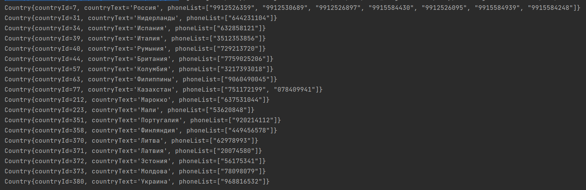

# Тестовые задачки
## Задание №1
Собрать все доступные номера в удобную структуру используя два метода:
- https://onlinesim.ru/api/getFreeCountryList
- https://onlinesim.ru/api/getFreePhoneList?country=?

Вывести все номера по всем странам в консоль, или файл, или графический  интерфейс на Swing или JavaFx.
Можно использовать любые библиотеки, чем меньше, тем лучше. 

Справка по api: https://onlinesim.ru/docs/api/ru/free/_info 

### Решение + скрин
[решение](/question1)

## Задание №2
Распарсить прайс-лист со страницы http://onlinesim.ru/price-list, Привести к виду:

Map<Название страны, Map<Название сервиса, цена>>.

Привести в json строку.

Полученные данные вывести в консоль или файл, или визуализировать (по  своему усмотрению) в окне написанном на Swing (JavaFx)

Примерный результат:

{
"Россия" : {
"Вконтакте" : 2,
"Mail.ru" : 1
...
},
"Германия" : {
"Вконтакте" : 2,
"Mail.ru" : 1
...
}
...
}

### Решение
[решение](/question2)

## Задание №3
Упростить (оптимизировать, улучшить читаемость).
### Решение
[решение](/question3)